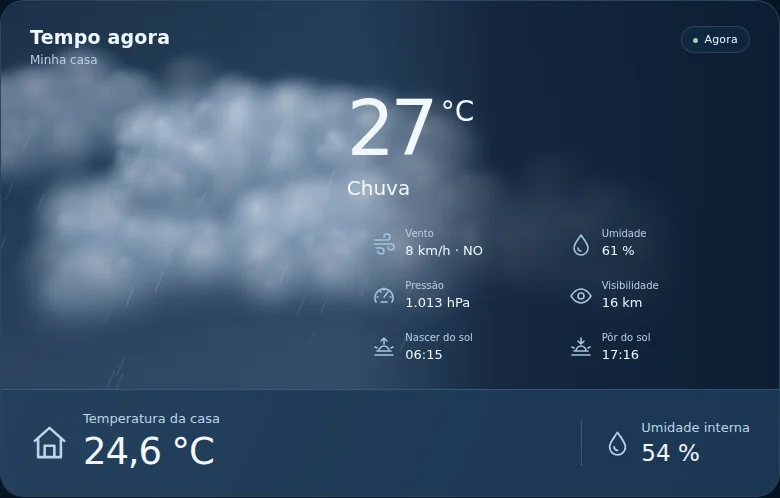
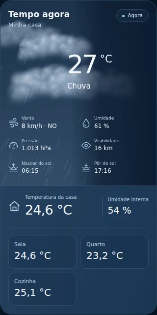

# Tempo Vivo 2

Card animado para Home Assistant: clima atual em cima, **temperatura e umidade da casa embaixo**. Sem faixa de previsão dos próximos dias.



## O que mudou na versão 2

- Céu desenhado em Canvas: sol, lua, estrelas, nuvens, chuva, temporal, neve, granizo, neblina, vento e efeito de calor.
- Transições de 3 segundos: nuvens chegam antes da chuva; a chuva para antes de as nuvens saírem. Atualizações de sensores preservam a cena.
- A partir de **2.0.1**, a integração cadastra o JavaScript como recurso Lovelace em painéis gerenciados pela interface. Atualizações trocam a versão da URL; recursos de outros cards são preservados. Painéis com recursos gerenciados por YAML usam o cadastro abaixo.
- Editor gráfico para selecionar entidades, tema, animações, limite de calor e temperaturas por cômodo.
- A entidade `weather` pode ser usada diretamente; o sensor da integração continua funcionando.
- Valores indisponíveis, sensores removidos e diferenças entre °C e °F são tratados.
- A animação pausa fora da tela e segue a preferência de movimento reduzido do navegador.

## Instalar pelo HACS

Requer Home Assistant 2024.8 ou posterior e um navegador moderno.

1. No HACS, abra **Repositórios personalizados** e adicione `https://github.com/Douglaslopes24/Tempo-vivo`, categoria **Integração**.
2. Baixe **Tempo Vivo** e reinicie o Home Assistant.
3. Em **Configurações → Dispositivos e serviços → Adicionar integração**, procure **Tempo Vivo**. Selecione a entidade de clima e, se quiser, os sensores da casa.
4. Recarregue o navegador. Em **Editar painel → Adicionar cartão**, procure **Tempo Vivo** e selecione as entidades no editor.
5. Em Home Assistant 2026.6 ou posterior, o card também é sugerido ao selecionar uma entidade `weather` ou o sensor da integração.

## Atualizar versões anteriores / corrigir o card ausente

1. No HACS, use **Atualizar** ou **Baixar novamente** e selecione **2.0.1** ou uma versão posterior.
2. Mantenha o recurso `/tempo_vivo/tempo-vivo-card.js` se ele já existir. A integração atualiza esse cadastro. A orientação anterior de removê-lo foi substituída por este procedimento.
3. Reinicie o Home Assistant e recarregue com Ctrl+F5. No aplicativo, feche e abra o painel se necessário.
4. Adicione o cartão **Tempo Vivo**, ou edite o cartão existente. O sensor agregado da instalação anterior continua sendo aceito, mesmo que seu ID tenha o nome repetido.

### Erro “Custom element doesn't exist: tempo-vivo-card”

Esse erro indica que o navegador não registrou o componente JavaScript. Trocar a entidade `weather` não corrige o carregamento.

Depois de atualizar e reiniciar, confira **Configurações → Painéis → menu ⋮ → Recursos**. Ative o **Modo avançado** no seu perfil se a opção não aparecer. Deve existir:

| Campo | Valor |
| --- | --- |
| URL | `/tempo_vivo/tempo-vivo-card.js?v=2.0.1` |
| Tipo | **Módulo JavaScript** |

Se faltar, adicione esse recurso. Se já existir com uma URL antiga, edite o mesmo cadastro. Recarregue o painel com Ctrl+F5 e adicione um cartão **Manual** com:

```yaml
type: custom:tempo-vivo-card
entity: weather.forecast_casa
```

`weather.forecast_casa` é um exemplo; use o ID da sua entidade de clima. Depois de salvar, o editor visual do card permite escolher o sensor de temperatura da casa.

Para verificar a instalação, abra `/tempo_vivo/tempo-vivo-card.js?v=2.0.1` no mesmo endereço e porta do seu Home Assistant. Deve aparecer o código JavaScript. **404** indica que o arquivo não está sendo servido: confirme que a integração foi adicionada em **Dispositivos e serviços**, reinicie o Home Assistant e consulte os registros de `custom_components.tempo_vivo`. Baixar no HACS sozinho não ativa a integração.

### Recursos gerenciados por YAML

Nesse modo a integração não altera seu arquivo de configuração. Acrescente o recurso em `configuration.yaml`, dentro da seção `lovelace` existente, preservando os demais recursos:

```yaml
lovelace:
  mode: yaml
  resources:
    - url: /tempo_vivo/tempo-vivo-card.js?v=2.0.1
      type: module
```

Mantenha o modo que seu painel já usa e atualize a versão dessa URL ao atualizar o card. Recarregue os recursos ou reinicie o Home Assistant e recarregue o navegador.

## YAML mínimo

Pode usar a entidade meteorológica diretamente:

```yaml
type: custom:tempo-vivo-card
entity: weather.sua_casa
indoor_temperature: sensor.temperatura_da_casa
indoor_humidity: sensor.umidade_da_casa
```

Ou o sensor agregado criado pela integração:

```yaml
type: custom:tempo-vivo-card
entity: sensor.tempo_vivo
```

Troque os exemplos pelos IDs reais. O seletor tenta encontrar a entidade automaticamente.

## Opções

| Opção | Função | Padrão |
| --- | --- | --- |
| `entity` | Entidade `weather` ou sensor Tempo Vivo | Obrigatória |
| `title` | Título | `Tempo agora` |
| `location` | Nome do local | Nome da entidade de clima |
| `theme` | `auto`, `dark`, `light` | `auto` |
| `animation` | Ativar movimento | `true` |
| `heat_threshold` | Limite de calor **em °C**; use `false` para desligar | `35` |
| `indoor_temperature` | Sensor de temperatura interna | Seleção da integração |
| `indoor_humidity` | Sensor de umidade interna | Seleção da integração |
| `outdoor_temperature`, `outdoor_humidity` | Sensores externos que substituem os dados da entidade weather | Entidade weather |
| `wind`, `pressure`, `visibility`, `feels_like` | Sensores de medidas atuais | Entidade weather |
| `sun_entity` | Entidade de posição e horários do sol | `sun.sun` |
| `sunrise`, `sunset` | Sensores de horário alternativos | `sun.sun` |
| `rain_sensor` | Sensor binário de chuva; `on` ativa a cena de chuva | Opcional |
| `storm_alert` | Sensor binário de temporal; `on` ativa a cena de temporal | Opcional |
| `heat_alert` | Sensor binário de onda de calor; `on` mostra o alerta | Opcional |
| `rooms` | Lista de sensores por cômodo | Opcional |
| `weather_entity` | Origem meteorológica explícita, usada com o agregado | Opcional |

Temperaturas são convertidas para a unidade do painel. O limite numérico exibe **Calor intenso**; **Onda de calor** é mostrado quando o sensor de alerta configurado fica `on`. Chuva, temporal e neve têm prioridade visual sobre o efeito de calor. O card acompanha o estado fornecido pelo Home Assistant; não prevê sozinho o começo da chuva.

```yaml
type: custom:tempo-vivo-card
entity: weather.sua_casa
title: Tempo agora
location: Minha casa
indoor_temperature: sensor.temperatura_da_casa
indoor_humidity: sensor.umidade_da_casa
heat_threshold: 35
animation: true
theme: dark
rooms:
  - name: Sala
    entity: sensor.temperatura_sala
  - name: Quarto
    entity: sensor.temperatura_quarto
    humidity_entity: sensor.umidade_quarto
```

## Demonstração do código real

Baixe [demo.html](demo.html) e abra no navegador. É um arquivo completo e funciona sem Home Assistant. Os botões simulam as mudanças de clima e o editor usa os mesmos componentes do card instalado. Os valores são de demonstração.



## Instalação manual

Copie `custom_components/tempo_vivo` para `<config>/custom_components/tempo_vivo`. Reinicie, adicione a integração e recarregue o navegador. O JavaScript acompanha a pasta da integração.

Para usar somente o JavaScript, copie `tempo-vivo-card.js` para `<config>/www/`, registre `/local/tempo-vivo-card.js` como **Módulo JavaScript** e configure uma entidade `weather` diretamente.

## Se o card não aparecer

- Confira se a integração **Tempo Vivo** foi adicionada e carregada, além de instalada no HACS.
- Confira o recurso **Módulo JavaScript** e recarregue o navegador depois de adicionar a integração, seguindo o procedimento acima.
- Em um card Manual, use `type: custom:tempo-vivo-card`.
- Para confirmar que o arquivo está disponível, abra `/tempo_vivo/tempo-vivo-card.js?v=2.0.1` no mesmo endereço do seu Home Assistant. Deve aparecer JavaScript.
- Se houver falha no carregamento da integração, consulte **Configurações → Sistema → Registros**.

## Verificação

O card foi executado em Chromium isolado com estados simulados do Home Assistant: 18 verificações passaram, incluindo transições, editor, dados indisponíveis, conversão de unidades e atualização ao vivo. Também foi inspecionado com 780 e 320 pixels de largura. As capturas deste README vêm do código real. O comportamento numa instância particular depende das entidades e da versão do Home Assistant; não houve acesso à instalação do usuário.

O cadastro do recurso tem 12 testes de regressão, incluindo início com armazenamento ainda não carregado, atualização, preservação de outros cards, múltiplas entradas, compatibilidade com versões antigas e fallback YAML. Há também 3 testes dos sensores. O teste de navegador verifica o arquivo externo como módulo, registro do editor, lista de cards, YAML mínimo e carregamento duplicado, além das 18 verificações visuais e de estados.

Para repetir: `python3 tools/build_demo.py`, `python3 -m unittest discover -s tests -p 'test_*.py'`, `npm install`, `npx playwright install chromium` e `npm test`. CI executa o navegador e Hassfest. Os testes usam interfaces e estados simulados; não verificam a instalação particular do usuário.

## Referências de estrutura

Foram consultados [Clock Weather Card](https://github.com/pkissling/clock-weather-card), [Dynamic Weather Card](https://github.com/teuchezh/dynamic-weather-card) e a [documentação de custom cards do Home Assistant](https://developers.home-assistant.io/docs/frontend/custom-ui/custom-card/). A implementação usa componentes próprios e não carrega bibliotecas, imagens ou scripts externos no painel.

Licença MIT.
